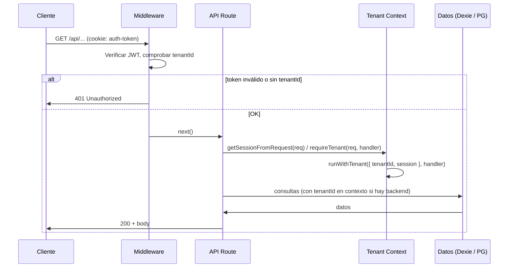

# Guía de Arquitectura Multi-Tenant y Seguridad (TT-112)

Esta guía documenta la estructura de capas, fronteras de confianza y flujos de datos de TalentOS en su evolución hacia SaaS multi-inquilino, alineada con **OWASP ASVS v4.0.3** y el plan de migración (ver [MIGRATION_PLAN_TICKETS.md](./MIGRATION_PLAN_TICKETS.md)).

**Relación con otros documentos:**

- [DATABASE_AUDIT_AND_STANDARDS.md](./DATABASE_AUDIT_AND_STANDARDS.md) — auditoría del modelo de datos y estándares.
- [DATABASE_STRUCTURE_AND_TECH.md](./DATABASE_STRUCTURE_AND_TECH.md) — estructura técnica actual de la BD.

---

## 1. Diagramas de arquitectura

### 1.1 Capas de la aplicación

```
┌─────────────────────────────────────────────────────────────────────────┐
│  CLIENTE (navegador)                                                     │
│  ┌─────────────┐  ┌─────────────┐  ┌─────────────────────────────────┐   │
│  │  Next.js    │  │  Dexie       │  │  Auth context / session (cookie)│   │
│  │  (React)    │  │  (IndexedDB) │  │  auth-token (JWT, httpOnly)     │   │
│  └──────┬──────┘  └──────┬───────┘  └─────────────────────────────────┘   │
└─────────┼───────────────┼────────────────────────────────────────────────┘
          │               │
          ▼               │
┌─────────────────────────────────────────────────────────────────────────┐
│  SERVIDOR (Next.js API Routes / Edge)                                    │
│  ┌───────────────────────────────────────────────────────────────────┐   │
│  │  Middleware (src/middleware.ts)                                    │   │
│  │  • Matcher: /api/*                                                  │   │
│  │  • Excluye: /api/auth/login, session, logout, nextauth               │   │
│  │  • Verifica JWT y exige tenantId → 401 si falta                     │   │
│  └───────────────────────────────────────────────────────────────────┘   │
│  ┌───────────────────────────────────────────────────────────────────┐   │
│  │  API Routes                                                        │   │
│  │  • getSessionFromRequest() / requireTenant() → tenantId en contexto │   │
│  │  • Audit (TT-109), GDPR (TT-110), Auth (login/logout)              │   │
│  └───────────────────────────────────────────────────────────────────┘   │
│  ┌───────────────────────────────────────────────────────────────────┐   │
│  │  Contexto de inquilino (src/lib/tenant-context.ts)                  │   │
│  │  • AsyncLocalStorage: tenantId + session por request               │   │
│  │  • getCurrentTenantId() para capa de servicio                       │   │
│  └───────────────────────────────────────────────────────────────────┘   │
└─────────────────────────────────────────────────────────────────────────┘
          │
          ▼
┌─────────────────────────────────────────────────────────────────────────┐
│  BACKEND DE DATOS (futuro / opcional)                                    │
│  • PostgreSQL + RLS (TT-101): SET app.current_tenant_id = '<uuid>'       │
│  • Todas las consultas filtradas por tenant_id a nivel BD                │
└─────────────────────────────────────────────────────────────────────────┘
```

### 1.2 Flujo de una petición protegida (/api/\*)



### 1.3 Fronteras de confianza

| Frontera                | Qué confía                                                                                                                                                | Qué no confía                                                                                          |
| ----------------------- | --------------------------------------------------------------------------------------------------------------------------------------------------------- | ------------------------------------------------------------------------------------------------------ |
| **Cliente → Servidor**  | El servidor solo acepta identidad/tenant desde el JWT verificado (firmado con JWT_SECRET). No se confía en headers (p. ej. `X-Tenant-Id`) para el tenant. | Cuerpo de petición, query params y headers son entradas no confiables; validar con Zod u otro esquema. |
| **Middleware → API**    | El middleware ya validó JWT y tenantId; la ruta puede usar getSessionFromRequest() y confiar en el resultado.                                             | No reutilizar el token en logs ni en respuestas.                                                       |
| **API → Base de datos** | Con PostgreSQL+RLS, la BD aplica políticas por `app.current_tenant_id()`; la app debe fijar ese valor por request.                                        | Sin RLS, la capa de aplicación es responsable de filtrar siempre por tenantId.                         |
| **Auditoría / GDPR**    | Los logs de auditoría (TT-109) no incluyen contraseñas ni tokens. La exportación ARCO (TT-110) excluye passwordHash.                                      | No registrar PII innecesaria en logs; sanitizar detalles.                                              |

---

## 2. Lógica de aislamiento de inquilinos

### 2.1 Dónde vive el tenant_id

- **JWT (cookie `auth-token`):** el payload incluye `tenantId` (UUID). Se establece en el login a partir de `user.tenantId` o `TENANT_ID_DEFAULT`.
- **Middleware:** para rutas `/api/*` protegidas, exige token válido y presencia de `tenantId` en el payload; si falta, responde 401.
- **API Routes:** usan `getSessionFromRequest(request)` o `requireTenant(request, handler)` para obtener la sesión y ejecutar el handler dentro de `runWithTenant`, de modo que `getCurrentTenantId()` y `getCurrentSession()` estén disponibles en la capa de servicio.
- **PostgreSQL (cuando se use):** en cada request, antes de cualquier query, ejecutar `SET app.current_tenant_id = '<uuid>'` (el UUID de getCurrentTenantId()). Las políticas RLS (TT-101) filtran todas las tablas compartidas por ese valor.

### 2.2 Reglas de negocio para aislamiento

1. **Nunca** devolver datos de otro inquilino: en cualquier listado o detalle, filtrar por el tenantId de la sesión actual.
2. **Nunca** confiar en un tenantId que venga en el cuerpo o en la URL para operaciones sensibles; usar siempre el del JWT/sesión.
3. Al crear recursos (curso, usuario, etc.), asignar siempre el `tenantId` del contexto actual.
4. Con backend PostgreSQL, no usar un rol con BYPASSRLS; el rol `talentos_app` no debe poder saltarse las políticas RLS.

### 2.3 Rutas públicas (sin exigir tenant)

- `/api/auth/login`
- `/api/auth/session`
- `/api/auth/logout`
- `/api/nextauth/*`

El resto de rutas bajo `/api/*` requieren JWT válido con `tenantId`.

---

## 3. Guía de seguridad para desarrolladores (Shift-Left)

Aplicar estas prácticas al diseñar o modificar código, según OWASP ASVS y estándares del proyecto.

### 3.1 Autenticación y sesión

- [ ] No almacenar contraseñas en claro; usar solo hash (Argon2) y comprobar con `verifyPassword`.
- [ ] No incluir en el JWT datos sensibles innecesarios; solo los claims mínimos (sub, email, role, tenantId).
- [ ] Mantener `JWT_SECRET` con al menos 32 caracteres y no commitearlo al repositorio.
- [ ] Las rutas protegidas deben obtener la sesión con `getSessionFromRequest()` o `requireTenant()` y rechazar (401) si no hay sesión o tenantId.

### 3.2 Multi-tenant

- [ ] En cualquier consulta que devuelva datos de negocio, filtrar por el tenantId de la sesión (o dejar que RLS lo haga si se usa PostgreSQL).
- [ ] No exponer IDs de otros inquilinos en URLs ni en respuestas (evitar IDOR).
- [ ] Usar UUID v4 para identificadores públicos (TT-103); no IDs secuenciales o predecibles.

### 3.3 Entradas y validación

- [ ] Validar todos los payloads de API con Zod (o esquema equivalente) antes de escribir en BD o reenviar a otros servicios.
- [ ] Limitar longitudes (p. ej. nombres, descripciones) según tipos en `src/lib/types.ts`.
- [ ] No confiar en `Content-Type` del cliente; validar el cuerpo según el contrato de la ruta.

### 3.4 Auditoría y privacidad

- [ ] Eventos de seguridad (login, logout, acceso denegado) deben registrarse con el módulo de auditoría (TT-109), sin incluir contraseñas ni tokens.
- [ ] Exportación de datos (ARCO) y borrado lógico (TT-110) deben excluir passwordHash y no registrar tokens en logs.
- [ ] Al registrar errores, no incluir PII en mensajes de log que puedan salir a sistemas externos.

### 3.5 Despliegue y configuración

- [ ] Usar HTTPS en producción; no enviar cookies de sesión por canal no cifrado.
- [ ] Variables sensibles (JWT_SECRET, claves de API, TENANT_ID_DEFAULT) solo en entorno o gestor de secretos.
- [ ] Revisar que el middleware y las rutas públicas estén alineados con la lista de rutas que no requieren tenant (ver arriba).

### 3.6 Cifrado PII y gestión de claves (TT-104)

- [ ] **HTTPS obligatorio:** Todos los endpoints deben servirse sobre HTTPS en producción. Se recomienda **TLS 1.3** (o al menos TLS 1.2); deshabilitar TLS 1.0/1.1. Configurar esto en el proxy inverso (Nginx, Cloudflare, o el servicio de hosting).
- [ ] **Key Vault en producción:** La variable `ENCRYPTION_SECRET` (usada para cifrado AES de PII y tokens sensibles) **no** debe estar en `.env` en producción. Debe obtenerse de un gestor de secretos:
  - **Azure:** Azure Key Vault; la aplicación obtiene el secreto al arranque o por inyección en el runtime (App Service / Key Vault references).
  - **AWS:** AWS Secrets Manager o Parameter Store.
  - **GCP:** Secret Manager.
  - **Otros:** HashiCorp Vault o variable de entorno inyectada por el orquestador (Kubernetes Secret, etc.).
- [ ] **AES-256:** Para cumplir con cifrado fuerte, `ENCRYPTION_SECRET` debe tener al menos **32 bytes** (256 bits). Con menos longitud, CryptoJS usa AES-128; con 32+ caracteres se obtiene efectivamente AES-256.
- [ ] Los campos PII identificados (nombre, email, teléfono) se cifran en reposo con el módulo `src/lib/pii-encryption.ts` antes de persistir en base de datos cuando el backend use PostgreSQL; en IndexedDB local el cifrado con clave de servidor no aplica de la misma forma (los datos están en el cliente).

---

## 4. Referencia rápida de código

| Necesidad                                            | Ubicación                                                                                                                     |
| ---------------------------------------------------- | ----------------------------------------------------------------------------------------------------------------------------- |
| Verificar sesión y obtener tenantId en una API route | `getSessionFromRequest(request)` o `requireTenant(request, handler)` en `src/lib/tenant-context.ts`                           |
| Obtener tenantId dentro de un handler ya protegido   | `getCurrentTenantId()` (dentro de `runWithTenant` / `requireTenant`)                                                          |
| Registrar evento de auditoría                        | `logAuthSuccess`, `logAuthFailure`, `logAuthLogout`, `logAccessDenied` en `src/lib/audit`                                     |
| Exportar datos de un usuario (ARCO)                  | `exportUserData(userId)` en `src/lib/gdpr.ts`                                                                                 |
| Solicitar borrado lógico (derecho al olvido)         | `requestErasure(userId, { notify: true })` en `src/lib/gdpr.ts`                                                               |
| Políticas RLS y esquema multi-tenant en PostgreSQL   | `migrations/001_extensions_and_tenants.sql`, `002_schema_talentos.sql`, `003_rls_policies.sql`                                |
| Cifrado/descifrado de PII (TT-104)                   | `encryptPii()`, `decryptPii()`, `isPiiEncryptionAvailable()`, catálogo `PII_FIELD_KEYS` en `src/lib/pii-encryption.ts`        |
| Validación de seguridad y aislamiento (TT-113)       | Checklist ejecutable: `docs/TT113_SECURITY_QA_CHECKLIST.md` (ZAP, Snyk, pruebas multi-tenant, ASVS L1, plantilla de informe). |

---

_Documento generado en el marco del ticket TT-112. Para el estado de los demás tickets del plan de migración, ver [MIGRATION_PLAN_TICKETS.md](./MIGRATION_PLAN_TICKETS.md)._
